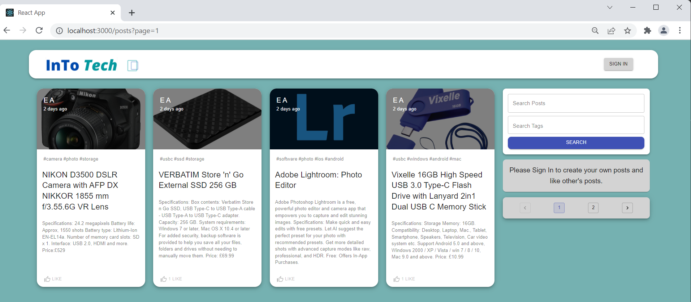
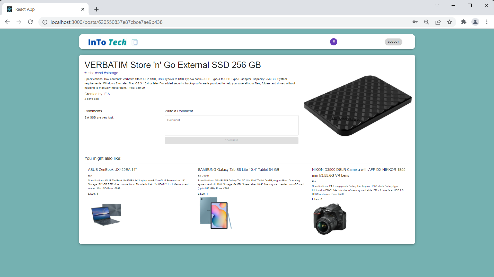
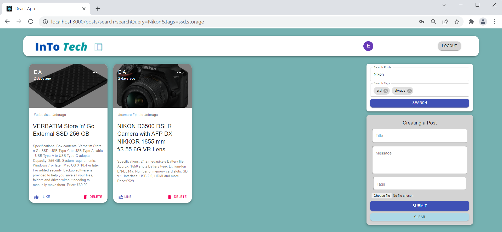

# intoTech

# About 

The intoTech project, software used to create this is: React, Node.js, Express & MongoDB also know as MERN which is a type of Full stack. 
The intoTech project is a simple social media application, with this app you can post any kind of tech which users may find useful with their work flow. 
A user can only create, like, edit, delete and comment posts if they have an account. 
The front end is React, the backend connected is Node.js on top of that Express and the database linked to this is MongoDB. 
